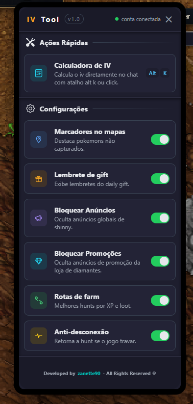
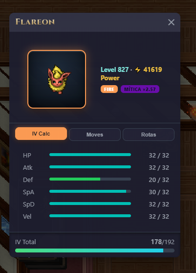
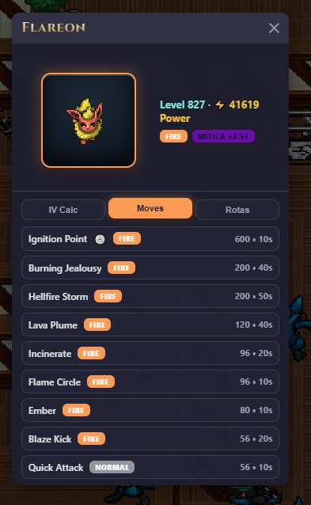
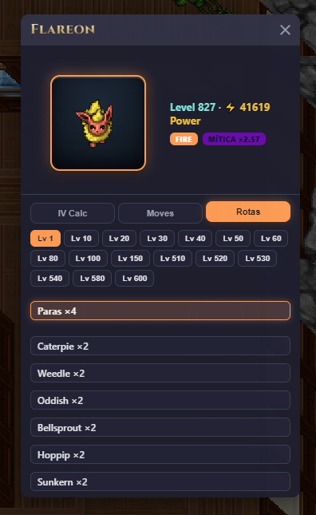
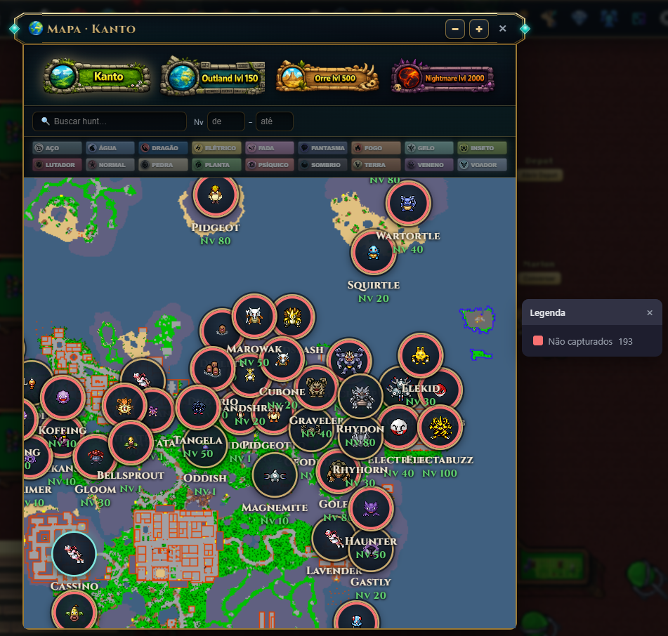
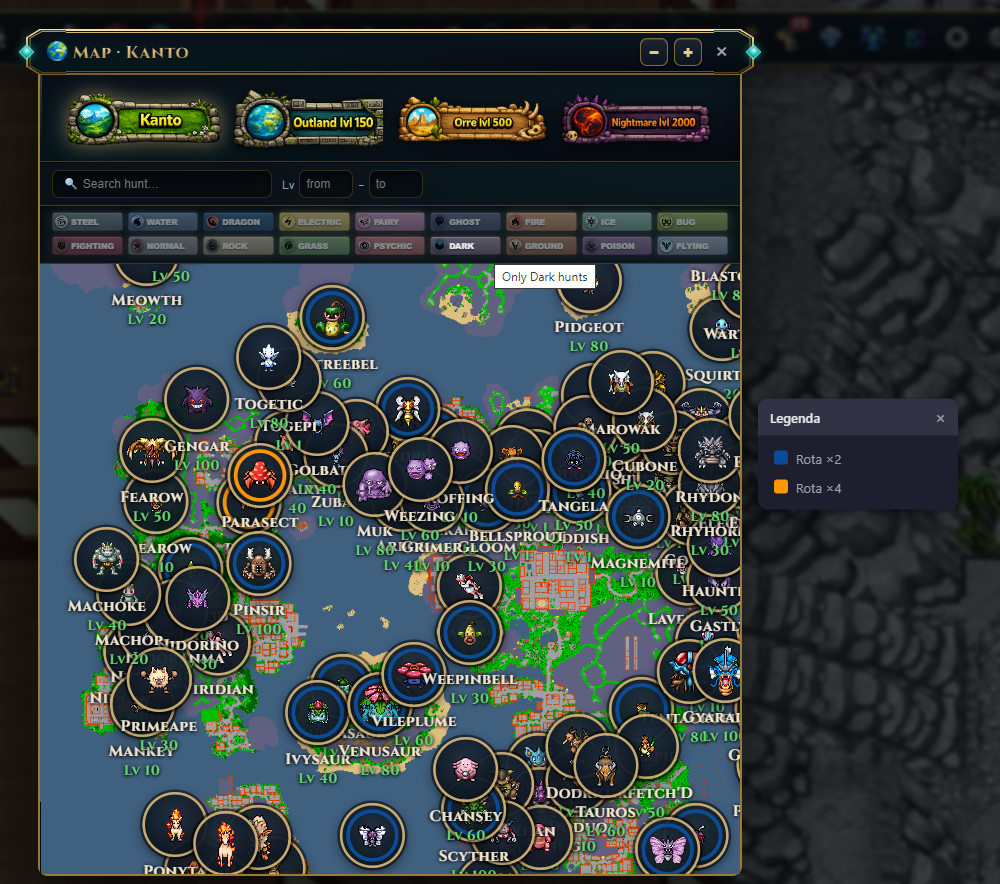

# PokeIdle IV Tool

Extensão Mod para o jogo **Poke Idle World** (`poke.idleworld.online`) com ferramentas de IV, marcação de mapa, rota de farm, anti-desconexão e keep alive para abas do chrome.

---

## Estrutura de arquivos

A extensão precisa destes arquivos na mesma pasta:

```
iv-tool/
├── manifest.json
├── background.js
├── content.js
├── inject.js
├── panel.html
└── panel.css
```

---

## Instalação no Chrome

1. Abra `chrome://extensions/`.
2. Ative o **Modo do desenvolvedor** (canto superior direito).
3. Clique em **Carregar sem compactação** (_Load unpacked_).
4. Selecione a pasta `iv-tool/`.
5. A extensão aparece na lista. Confirme que não há erros em vermelho no card dela.

Sempre que editar um arquivo, volte em `chrome://extensions/` e clique no ícone de **recarregar** no card da extensão.

---

## Configurações do Chrome necessárias

### 1. Manter a aba do jogo sempre ativa (Memory Saver)

1. Abra `chrome://settings/performance`.
2. Em **Economia de memória** (_Memory Saver_), localize **Manter sempre estes sites ativos**.
3. Adicione: `poke.idleworld.online`.

### 2. Restaurar abas ao reabrir o Chrome

1. Abra `chrome://settings/onStartup`.
2. Selecione **Continuar de onde parou**.

Assim, se o navegador for encerrado de forma anormal, ao reabrir ele restaura a aba do jogo.

### 3. Verificar descarte de abas (diagnóstico)

Para inspecionar se o Chrome está descartando a aba do jogo:

- Abra `chrome://discards`.
- Localize a linha do `poke.idleworld.online`.
- A coluna de contagem de _discards_ deve ficar em **0**. Se subir, revise a configuração do Memory Saver acima.

## Facilitadores

Acessíveis pelo botão **⚙ IV Tool** na tela do jogo.

- **Alt + K** — Abre e fecha o painel de IV.
- **Alt + F** — Visualiza a rota de farm no mapa.

---

Ao clicar em um tooltip no chat caso seja de uma criatura abre o calculo de iv respectivo. O mesmo comportamento ocorre na tela de time e na tela de listagem.

- **Cálculo de Iv** — Calcula o IV real de cada atributo atraves do atalho alt + k ou click.

- **Marcadores** — Adiciona efeito visual no mapa para identificar pokemons sem captura pelo atalho alt + K.
- **Presentes** — Adiciona lembretes para nao esquecer de pegar os presentes diários.
- **Anúncios** — Controla a exibição de anúncios globais na sua tela.
- **Promoções** — Controle a exibição de anuncio de promoções da loja do jogo.
- **Rotas** — Visualize os melhores locais para xp ou gold.
- **Keep Alive** — Detecta quedas no servidor ou travamentos na sua aba do chrome.
- **Safe Hunt** - Caso o personagem morra diversas vezes em curto periodos cancela a hunt para evitar perda de xp.

---

## Comportamento Keep Alive por cenário

| Situação                   | O que acontece                                                                   |
| -------------------------- | -------------------------------------------------------------------------------- |
| Sua internet cai           | Reconecta-se ao jogo quando a rede volta.                                        |
| Servidor cai               | Reconecta-se assim que o servidor voltar.                                        |
| Aba trava                  | Recarrega a aba que esta travada e volta ao jogo.                                |
| Chrome inteiro fecha/trava | Configuração "Continuar de onde parou" restaura a aba ao reabrir e volta a hunt. |

---

## Fluxo de recuperação automática

```
Aba do navegador trava
   → heartbeat para
   → watchdog detecta
   → chrome reload na aba
   → jogo recarrega e loga
   → cai na cidade
   → refaz o caminho até a hunt
   → checkHunt volta a monitorar
```

## Parâmetros ajustáveis

| Parâmetro    | Arquivo       | Valor atual      | O que faz                                                                                                                      |
| ------------ | ------------- | ---------------- | ------------------------------------------------------------------------------------------------------------------------------ |
| `TIMEOUT_MS` | background.js | `120000` (2 min) | Tempo sem heartbeat até considerar a aba travada. Alto o suficiente para tolerar o _throttle_ de abas em background/multi-aba. |
| heartbeat    | content.js    | `5000` (5s)      | Frequência com que a aba avisa que está viva.                                                                                  |
| `checkHunt`  | content.js    | `60000` (1 min)  | Frequência da checagem de kills.                                                                                               |
| `backHunt`   | content.js    | `10000` (10s)    | Frequência da checagem de anti-desconexão.                                                                                     |

---

## Limitações conhecidas

- **Falta de Memória RAM (OOM - Out of Memory)** - Se o SISTEMA OPERACIONAL ficar com pouca memória RAM irá encerrar o processo do Worker imediatamente para liberar memória para o sistema. Nesse caso de limitação de hardware abra menos abas.

- **Falta de Armazenamento Disponível (Storage Quota)** - Falta de espaço no disco rígido pode ocasionalmente fechar o worker.

- **Modo Economia de energia (Throttling de CPU e Bateria)**
  Se o dispositivo entrar em modo de economia de energia, o Chrome aplica um throttling (limitação) severo de CPU e pode ocasionalmente fechar o worker.

---

## Screenshots








## Termos de uso

Automação e extensões podem violar os termos de serviço do jogo. Verifique as regras do Poke Idle World antes de usar. O uso é de responsabilidade do usuário, pois o usuário tem total controle para desativar as funcionalidades dessa extensão. A extensão não coletadados do usuário nem envia para api de terceiros toda comunicação é entre o servidor e o navegador.
